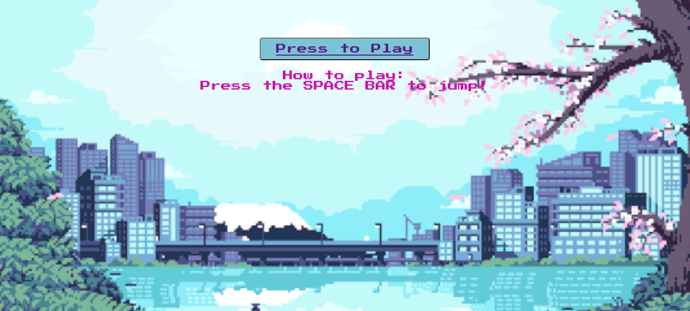
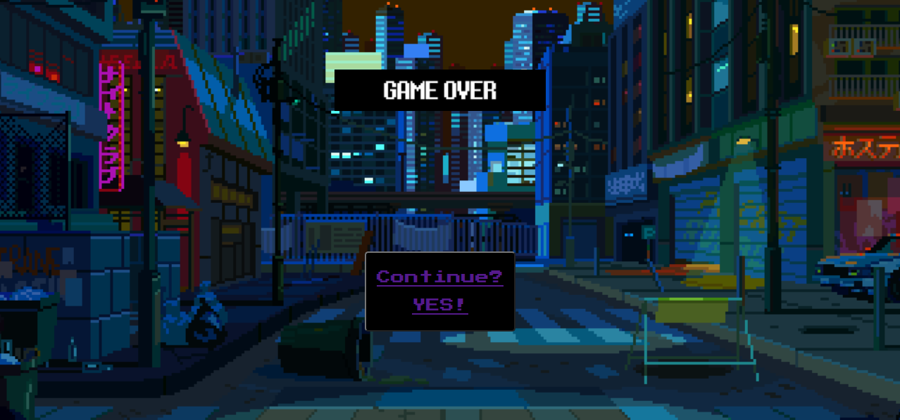

SKATE GIRL TAKES JAPAN  

This is a version of Steve the jumping Dinosaur game using HTML, CSS, JS & JS Canvas.  
The main objective is the game is easy: avoid the obstacles by jumping.
Use the space bar to jump and avoid the random obstacles that appear. 

Backlog  
Data structure
1. index.html
2. style.css
3. background.html
4. index.js
5. gamepage.css
6. gameover.html
7. gameover.css

index.js

• Creates a Player

• Has a method bound to keydown events to jump when you press the spacebar. 

• Creates 3 obstacles that move in different speed each one. 

• Creates a score 

• StartGame:  
 • Creates canvas container and dimensions. 
 • Generates game animation. 
 • Clears the canvas. 
 • Draws the background, the player and the obstacles.  
 • Handles the collission logic. 

• Set Interval:  
   • Generates a random obstacle loop. 
   • Adds points to the score  

• CrashingTime:  
   • Handles obstacle collision logic. When the coordenades of the player and the obstacles overlap, your game is over.  
   • The loop stops and it takes you to the game over page. 

   

Links
Trello https://trello.com/b/MNcVAU3z/game-project  
Link url https://laurindor.github.io/Skater-girl-takes-Japan/  
Link Repo  https://github.com/laurindor/Skater-girl-takes-Japan  
Slides https://slides.com/lauramarcos/deck  
